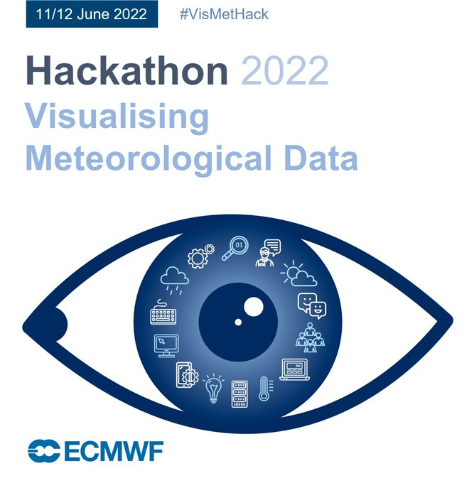

# ECMWF Hackathon 2022: Visualising Meteorological Data

 
</img>

 

The aim of the #VisMetHack @ECMWF 2022 is to explore how meteorological data, weather and climate, can be visualised to be more **useable, understandable and impactful** for users and the broader public. The hackathon will take place in-person at the ECMWF headquarter in Reading UK on 11-12 June 2022.

This is not your usual Hackathon. We are looking for a wide range of experience to help with the challenges, ideas and projects. If you are a coder, designer, data wrangler, meteorologist, storyteller, journalist... or just have an interest in meteorological data and visualisation this is the event for you.

 

## Challenges
The hackathon has four challenge categories:

### Visualising data - #VisData
Show your ideas how you would visualise ECMWF data better.  
[>> See proposed challenges under this category](https://github.com/vismethack/challenges/issues?q=is%3Aissue+is%3Aopen+label%3A%23VisData)

### Telling stories with data - #StorytellingData
Dive into visual storytelling and tell us a visual story about weather or climate.  
[>> See proposed challenges under this category](https://github.com/vismethack/challenges/issues?q=is%3Aissue+is%3Aopen+label%3A%23StorytellingData)

### Data processing - #101MemberEnsemble
Get your hands on massive amounts of multi-dimensional data and show us how you would visualise 101 ensemble members.  
[>> See proposed challenges under this category](https://github.com/vismethack/challenges/issues?q=is%3Aissue+is%3Aopen+label%3A%23101MemberEnsemble)

### Open - #OpenHack
Submit your own challenge idea related to *Visualising Meteorological Data*.  
[>> Submit your challenge as a new issue](https://github.com/vismethack/challenges/issues)

## How it works
Browse through the proposed challenges [here](https://github.com/vismethack/challenges/issues), indicate your interest in the challenge and / or ask clarifying questions. At the same time, it is a great space for you to engage with fellow hackathon attendees before the hackathon weekend and to look for team members with which you work on the challenge during the hackathon weekend together.

## Useful data
Some example data: https://get.ecmwf.int/#browse/browse:vishackathon  
ECMWF OPEN DATA: https://confluence.ecmwf.int/display/UDOC/ECMWF+Open+Data+-+Real+Time  
ECMWF open-data API: https://github.com/ecmwf/ecmwf-opendata  
Climate data store: https://cds.climate.copernicus.eu/#!/home - Climate and environmetal data  
DWD open data portal: https://dwd-geoportal.de/  
1km dataset on ZENODO: https://doi.org/10.5281/zenodo.6633929  

## Further links
* [Hackathon 2022: Visualising Meteorological Data](https://events.ecmwf.int/event/305/)
* [Registration form](https://events.ecmwf.int/event/305/registrations/189/)
